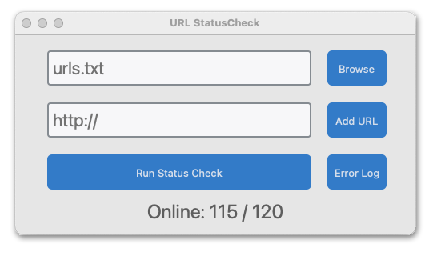

# URL StatusCheck
Allows website administrators to manage a list of URL addresses and then determine if any are currently offline.

Offline webpages are logged to a csv spreedsheet and include the status code error and timestamp.

#Tech
- Python
- Tkinter
- Pandas
- Requests

#Screenshot

